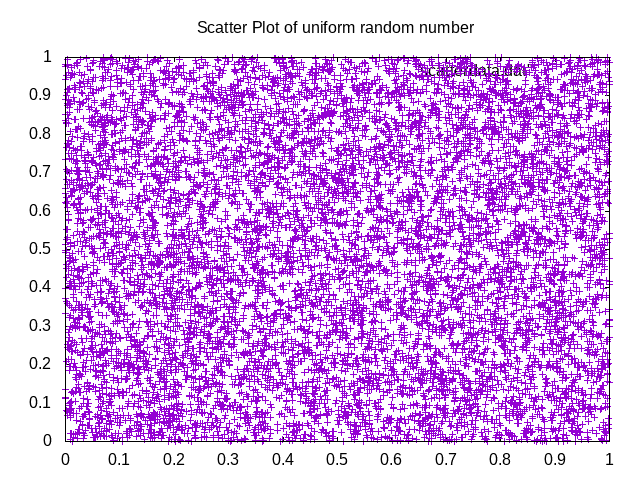
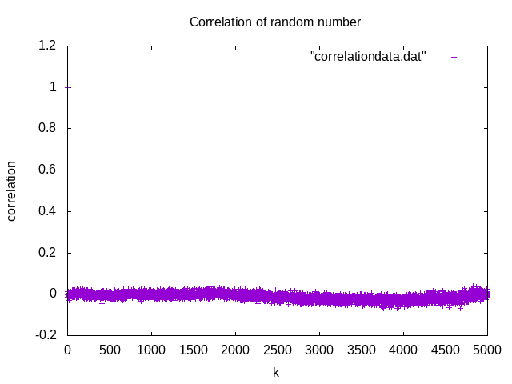
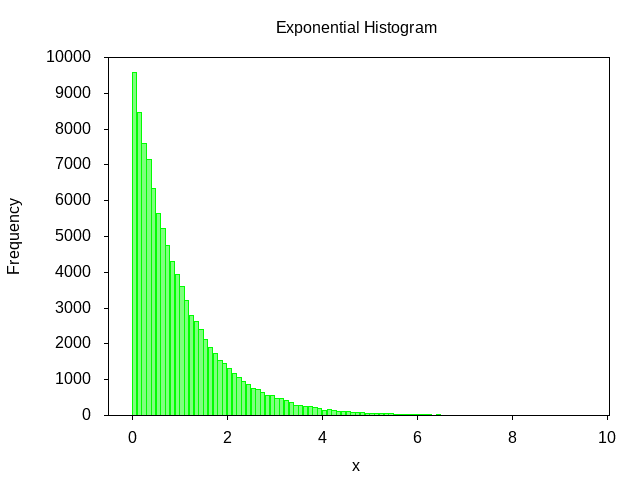

# PHY453: Computational Physics #

This notebook contains all the assignements for the course "PHY453: Computational Physics".


## Trapezoidal Integration
We want to find the value of $\pi$ using the $\int_{0}^{1} \frac{1}{1+x^2}dx$. 

We are going to use the Trapezoidal rule to calculate the value of the integration numberically.

If we want to integrate the function $$ I= \int_{a}^{b}f(x)dx $$
We can take $\{x_k\}$ be the partition of \[a,b\] such that $$ a=x_0<x1<x2<....<xN=b$$ Where $$ x_k=a+k*h \\ h=\frac{b-a}{N} $$ Then we can approximate $$ I \approx \sum_{k=0}^{N-1}\frac{f(x_k)+f(x_{k+1})}{2}*h=\frac{(f(a)+f(b))}{2}*h + \sum_{k=1}^{N-1}f(x_k)*h $$

The approximated value get closer to the real value of the integration as we increase the value of $N$.

The below fortran code implements trapezoidal integration on $\int_{0}^{1} \frac{1}{1+x^2}dx$. The actual value of the integration is $\pi$. We keep increasing the value of $N$ untill the error is greater than $10^{-10}$.


```python
!cat Trap_integration/trap_integration.f90
```

    program Trapazoidal
            !This program finds the value of pi using Trapezoidal integration.
            !The function used is 4/(1+x**2)
          implicit none
          real*8:: h,x0,xn,Area,x,error,f0,fn,func
          integer:: n,i
    
          x0=0.0d0
          xn=1.0d0
          f0=func(0.0d0)
          fn=func(1.0d0)
          n=1000
          error=100
         open(unit=21,file="error.dat") 
         open(unit=22,file="error_vs_n.dat")
          do while (abs(error)>1e-10)
            n=n+100
            h=(xn-x0)/real(n)
            Area=(h*(f0+fn))/2.0d0
            
            do i=1,n-1
                    x=x0+h*i
                    Area=Area+func(x)*h
            end do
            
            error=4.0d0*atan(1.0d0)-Area
            print*, n, Area, error
    
            write(21,*) 1.0d0/(n**2), error
            write(22,*) n,error
          
          end do
            
    
    
    end program Trapazoidal
    
    
    function func(x) result(y)
          real*8::x,y
          y=(4.0d0/(1+x**2))
    end function func


-------------------
If we print out the 10 lines each from the file "error_vs_n.dat", we can see how $error$ is decreasing with increasing $N$.


```python
!head -n 10 error_vs_n.dat && echo "...................................................." && tail -n 10 error_vs_n.dat


```

            1100   1.3774105411812343E-007
            1200   1.1574073521813943E-007
            1300   9.8619330923810367E-008
            1400   8.5034013164175803E-008
            1500   7.4074070433027828E-008
            1600   6.5104160729134719E-008
            1700   5.7670131781151213E-008
            1800   5.1440332438090763E-008
            1900   4.6168054268491687E-008
            2000   4.1666673666895804E-008
    ....................................................
           40000   1.0417622320346709E-010
           40100   1.0361045355011811E-010
           40200   1.0313305764952929E-010
           40300   1.0260770011427667E-010
           40400   1.0212897194605830E-010
           40500   1.0158895946688062E-010
           40600   1.0109157955184855E-010
           40700   1.0060396959943319E-010
           40800   1.0012746187726407E-010
           40900   9.9622976534874397E-011


If we plot the graph between $error$ vs $N$, we can see how error falls with increasing $N$.


Theoretically, $$error \propto \frac{1}{n^2}$$ If we plot $error$ vs $\frac{1}{N^2}$,


Which gives us a straight line, proving $error \propto \frac{1}{n^2}$

----------------

## Random Number Testing ##

In this exercise we want to do'
1. Mean and Standard deviation of Uniformly generated random number.
2. Scatter plot of uniformly generated random number.
3. Correlation of uniformly generated random number.

Below fortran code generates uniform random number and calculate their mean and standard deviation for $N=10^2,10^3,...,10^8$. It also generates scatter plot for 10000 pair of random number and calculates correlation averaging over 100000 random numbers.

To check what happens to the correlation if we average over small number of random numbers, I have added code to calculate the correlation for 100 random number.


```python
!cat Random/randomtest.f90
```

    program randomtest
            implicit none
    
            real*8:: sums,sq_sums,mean,sq_mean,sigma,c_k,sum2
            integer:: n,i,j,k,m
            real*8, allocatable, dimension(:):: r
            character(len=32):: filename
    
            open(21,file="meandata.dat")
            open(22,file="data.dat")
    
    
            do j=2,8
                    n=10**j
            
                    allocate(r(n))
    
                    call random_number(r)
                    ! Calculating the mean and standard deviation
                    sums=0.0d0
                    sq_sums=0.0d0
                    do i=1, n
                            sums=sums+r(i)
                            sq_sums=sq_sums+r(i)**2
                    end do
    
                    mean=sums/real(n)
                    sq_mean=sq_sums/real(n)
                    sigma=sqrt(sq_mean-mean**2)
                    write(*,*) "number of random number:",n
                    write(*,*) "The mean is:", mean
                    write(*,*) "The standard deviation is:", sigma
                    write(21,*) 1.0d0/sqrt(real(n)),abs(mean-0.5d0)
                    write(22,*) n,mean,sigma
    
                    
                    if (n==10000) then
                            open(23,file="scatterdata.dat")
                    ! Scatter plot
                            do i=1,n-1
                                    write(23,*) r(i),r(i+1)
                            end do
                            
                           
                    end if
                    !Correlation plot
                    if (n==100000) then
                            open(24,file="correlationdata.dat")
                            do m=1,1000
                                    k=m-1
                                    sum2=0.0d0
                                    do i=1,n-k
                                            sum2=sum2+r(i)*r(i+k)
                                    end do
                                    sum2=sum2/real(n-k)
                                    c_k=(sum2-mean**2)/sigma**2
    
                                    write(24,*) k,c_k
                           end do
                    end if
                    !Calculating correlation for small number of random number
                    if (n==100) then
    
                            open(26,file="correlationdata_small_n.dat")
                            do m=1,50
                                    k=m-1
                                    sum2=0.0d0
                                    do i=1,n-k
                                            sum2=sum2+r(i)*r(i+k)
                                    end do
                                    sum2=sum2/real(n-k)
                                    c_k=(sum2-mean**2)/sigma**2
    
                                    write(26,*) k,c_k
                           end do
                    end if
    
    
    
                                            
                                    
                    deallocate(r)
           end do
                    
    end program randomtest
    


-------------
The fortran random number generator generates uniform random number in the range [0,1], Which should have a mean $\frac{1}{2}$ and standard deviation $\frac{1}{\sqrt{12}}$. If we display the mean and standard deviation for different value of $N$


```python
!cat Random/data.dat
```

             100  0.48178876732060788       0.29646068464055253     
            1000  0.49875663349048366       0.28555082549750493     
           10000  0.49784174015751886       0.28942543637868146     
          100000  0.50131936988705905       0.28795544861142314     
         1000000  0.50017467026179852       0.28862786817378605     
        10000000  0.50012368778214222       0.28872697969385780     
       100000000  0.50001353829144346       0.28865940448814625     


The first coloumn is the number of random number generated, second column is mean and third coloumn is standard deviation. Value of $\frac{1}{\sqrt{12}}$ is 0.28867513459481288. So, we can see the standard mean and standard deviations are matching with the real value, so we can infere that the random number generator is generating from uniform distribution.

--------------
Now to see how $\left|(mean-0.5)\right|$ varies with $N$,


But this plot has very few random number, also the $\frac{1}{\sqrt(N)}$ are not evenly spread out.

So I have written a separate code to see plot $(mean-0.5)$ vs $N$


```python
!cat Random/meantest.f90
```

    program MeanTest
          implicit none
    
          real*8:: r, mean, sums,abs_error,sq_sums,sigma
    
          integer:: n,i
          open(21,file="meantest.dat")
    
          n=1000
    
          do while (n<1e5)
            sums=0.0d0
    
            do i=1,n
                    call random_number(r)
                    sums=sums+r
    
            end do
            mean=sums/real(n)
            abs_error=abs(mean-0.5)
            write(21,*) 1/sqrt(real(n)),abs_error
            write(*,*) n,abs_error,mean
            n=n+100
    
          end do
          
    end program MeanTest
            
    


If we plot the graph,


It does not tell that $\left|(mean-0.5)\right|$ is not linear with $\frac{1}{\sqrt{N}}$

#### Scatter plot ####
The scatter plot is  Which demonstrate that our random number is uniformly distributed over the area.

The correlation plot comes as below, 

We can see that the correlation is near to 0. To visulize the graph better we can plot the graph for small values of k.


Which tells us that our random number are not correlated with each other.

If we take a small set of random number to calculate the correlation,  We can see the deviation of the correlation about 0 is very high. As we increase the number of random numbers, the fluctuation decreases, demonstrating **Law of large number**.

### Random number generation and histogram plot ###

Lot of times we will need to generate random numbers from different probability distribution other than uniform distribution. Fortran `CALL RANDOM_NUMBER()` gives us a uniform distribution. We can generate our required distribution from this uniform by doing variable transformation or other method (Box Mullar in case of Gaussian). In this exercise, we want to generate the ranodm number and plot the histogram for
1. Uniform Distribution
2. Exponential Distribution
3. Gaussian Distribution

#### Uniform Histogram ####

The code below generates $10^5$ random number and put them into 10 bin according to where they lie in [0,1].


```python
!cat Histogram/uniform_histogram.f90
```

    program Uniform
          implicit none
    
          real*8:: r
          integer,allocatable,dimension(:):: bin
          integer:: n,i,nbin
          n=100000
    
          nbin=10
    
          open(21,file="uniform_histogram.dat")
          open(22,file="uniform_data.dat")
    
          allocate(bin(nbin))
    
          bin=0
          do i= 1,n
            call random_number(r)
            write(22,*) r
            r=nbin*r
            bin(int(r)+1)=bin(int(r)+1)+1
          end do
          write(*,*) bin
          
          do i=1,nbin
            
            write(21,*) i,bin(i)
          end do
    
    
    end program Uniform
    
    


```python
!cat Histogram/uniform_histogram.dat
```

               1        9989
               2        9898
               3        9922
               4       10000
               5       10106
               6       10043
               7       10014
               8       10025
               9        9994
              10       10009


We can see all the bins have random number close to 10000.

This program saves all the $10^5$ random number in a single array in the file "uniform_data.dat". We can use **gnuplot** to plot histogram using the random number. For that we can use the gnuplot script below


```python
!cat Histogram/uniform_histogram.plt
```

    reset
    n=10 #number of bins 
    max=1. #max value
    min=0. #min value
    width=(max-min)/n #interval width
    #function used to map a value to the intervals
    hist(x,width)=width*floor(x/width)+width/2.0
    set term png #output terminal and file
    set output "uniform_histogram.png"
    set xrange [min:max]
    set yrange [0:]
    #to put an empty boundary around the
    #data inside an autoscaled graph.
    set offset graph 0.05,0.05,0.05,0.0
    set xtics min,(max-min)/5,max
    set boxwidth width*0.9
    set style fill solid 0.5 #fillstyle
    set tics out nomirror
    set title "Uniform Histogram"
    set xlabel "x"
    set ylabel "Frequency"
    #count and plot
    plot "uniform_data.dat" u (hist($1,width)):(1.0) smooth freq w boxes lc rgb"green" notitle


Which gives us the below histogram.


This is a positive test for the uniform random number generator

#### Exponential Random Number ####

If x is random number from a uniform distribution in the range [0,1] we can get a random number y from $\text{pdf}= e^{-y}$ by doing the below tranformation $$y=-\log{(1-x)}$$

Here is the fortran code


```python
!cat Histogram/exponential_histogram.f90
```

    program Exponential
          implicit none
    
          real*8:: r
          integer:: n,i
    
          n=100000
    
          open(22,file="exponential_data.dat")
    
          do i=1,n
            call random_number(r)
            r=-log(1-r)                 ! pdf=e**(-x) from (0,infinity)
            write(22,*) r
          end do
    
          
    end program Exponential


This program generates $10^5$ random number and store them in the file "exponential_data.dat". We can use gnuplot to generate histogram for this numbers.


```python
!cat Histogram/exponential_histogram.plt
```

    reset
    n=100 #number of intervals
    max=10. #max value
    min=0. #min value
    width=(max-min)/n #interval width
    #function used to map a value to the intervals
    hist(x,width)=width*floor(x/width)+width/2.0
    set term png #output terminal and file
    set output "exponential_histogram.png"
    set xrange [min:max]
    set yrange [0:]
    #to put an empty boundary around the
    #data inside an autoscaled graph.
    set offset graph 0.05,0.05,0.05,0.0
    set xtics min,(max-min)/5,max
    set boxwidth width*0.9
    set style fill solid 0.5 #fillstyle
    set tics out nomirror
    set title "Exponential Histogram"
    set xlabel "y"
    set ylabel "Frequency"
    #count and plot
    plot "exponential_data.dat" u (hist($1,width)):(1.0) smooth freq w boxes lc rgb"green" notitle
    
    
    loghist(x,width)=-log(width*floor(x/width)+width/2.0)
    set output "logplot.png"
    set xrange [min:max]
    set yrange [0:]
    set offset graph 0.05,0.05,0.05,0.0
    set xtics min,(max-min)/5,max
    set boxwidth width*0.9
    set style fill solid 0.5 #fillstyle
    set tics out nomirror
    set title "Semilog histogram of exponential plot"
    set xlabel "y"
    set ylabel "-log(frequency)
    
    plot "exponential_data.dat" u (loghist($1,width)):(1.0) smooth freq w boxes lc rgb"green" notitle


Here We are using 100 bins in the range[0,10]. 


To verify that this curve is indeed $e^{-x}$, we can plot $(-\log{(frequency)})$ vs $y$, which should give us a straight line.


```python

```
